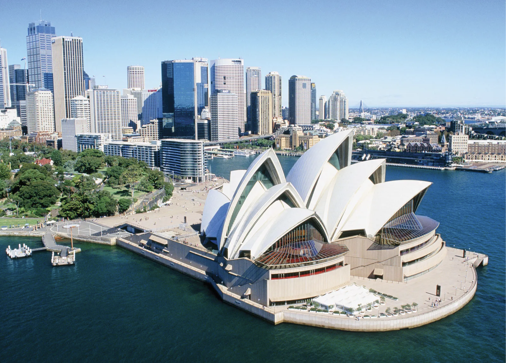

# Architectural Marvels

Cities are home to some of the most remarkable architectural feats, each telling a story of innovation, culture, and history. This page highlights some of the most iconic buildings from around the world.

## The Eiffel Tower, Paris

The Eiffel Tower is not just a symbol of Paris but a masterpiece of iron architecture. Designed by Gustave Eiffel, it stands at 324 meters tall and was completed in 1889. [Learn more](https://www.toureiffel.paris/en).

## The Guggenheim Museum, New York

Designed by Frank Lloyd Wright, the Guggenheim Museum in New York is an architectural icon, known for its unique spiral design. It opened in 1959 and continues to attract art lovers from around the world. [Explore more](https://www.guggenheim.org/).

## The Sydney Opera House, Sydney

A masterpiece of modern architecture, the Sydney Opera House was designed by Jørn Utzon and completed in 1973. Its unique sail-like design makes it one of the most recognizable buildings in the world. [Visit the official site](https://www.sydneyoperahouse.com/).
