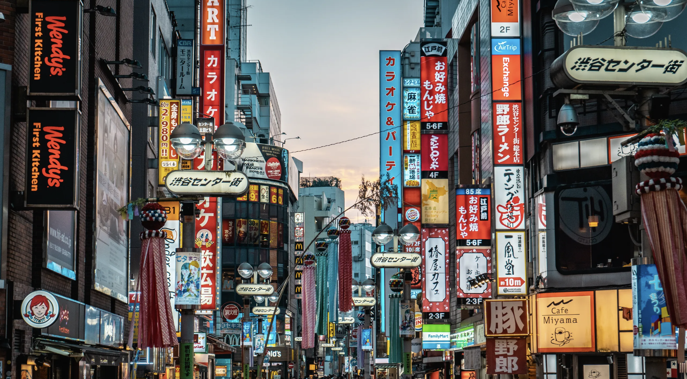
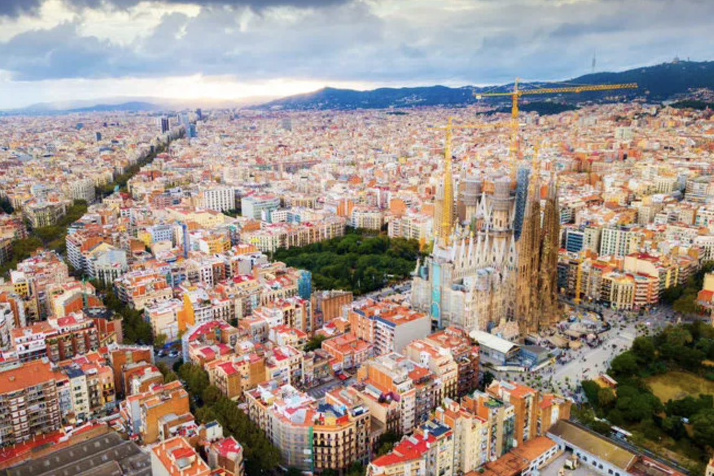

# City Guides

Explore the best that cities around the world have to offer. From hidden gems to iconic landmarks, our city guides will help you plan your next urban adventure.

## New York City

Known as the "city that never sleeps," New York offers endless attractions, from the bright lights of Times Square to the serene paths of Central Park. [Check out our full guide](https://www.nycgo.com/).

## Tokyo

A city where tradition meets innovation, Tokyo is a bustling metropolis with a unique blend of ancient temples and cutting-edge technology. [Discover Tokyo's neighborhoods](https://www.gotokyo.org/en/).

## Barcelona

Home to Gaudí's masterpieces and beautiful Mediterranean beaches, Barcelona is a vibrant city full of culture, history, and stunning architecture. [Explore Barcelona](https://www.barcelonaturisme.com/wv3/en/).

### Interactive Maps

Below are interactive maps to help you navigate these cities:

- **New York City**: [Google Maps Link](https://www.google.com/maps/place/New+York,+NY,+USA/)
- **Tokyo**: [Google Maps Link](https://www.google.com/maps/place/Tokyo,+Japan/)
- **Barcelona**: [Google Maps Link](https://www.google.com/maps/place/Barcelona,+Spain/)
