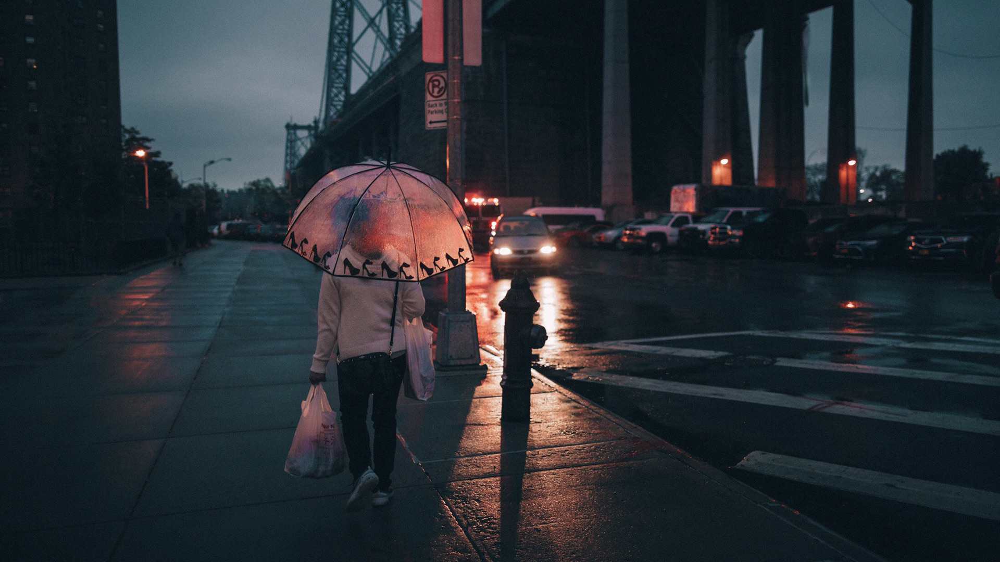

# Street Photography

Street photography captures the essence of urban life, reflecting the culture, energy, and emotions of the people and places within a city. This page offers tips, techniques, and examples to help you improve your street photography skills.

## Techniques for Capturing Urban Life

- **Candid Shots:** Capture unposed, spontaneous moments that tell a story.
- **Use of Light:** Experiment with natural and artificial light to add depth and mood to your photos.
- **Framing and Composition:** Look for interesting angles and frames to create compelling compositions.

### Featured Photographs

Here are some examples of stunning street photography:

### Tools and Resources

- [Best Cameras for Street Photography](https://www.digitalcameraworld.com/buying-guides/best-camera-for-street-photography)
- [Editing Tips](https://www.adobe.com/creativecloud/photography.html)
